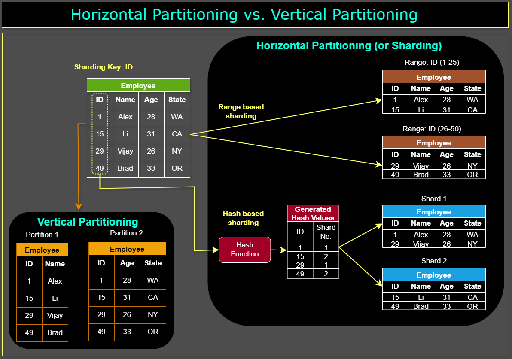

1. [Overview](#overview)
2. [Features](#features)

### Features
- [x] Authenticaion using JWT 
- [x] Realtime reserving seats concurrently using Redis, Postgresql
- [x] Realtime searching millions of records using Elastic Search
- [x] Realtime newsfeed using SSE, Redis Pub sub
- [x] Peer to peer messages using Websocket, Redis Pub sub
- [x] Peer to peer messages using Websocket, Kafka
- [x] Messages storage using MongoDB
- [x] File uploads
- [ ] Blockchain interaction

### Technologies
- [x] Postgresql
- [x] Elastic Search
- [x] Kafka
- [x] MongoDB
- [x] Minikube
- [ ] GraphQL
- [ ] gRPC
- [ ] Google Cloud Platform deployment
- [ ] Big Query
- [ ] RabbitMQ

### Technique
- [ ] Database partition
- [ ] Token decentralization
- [ ] Stored Procedure
### Ingredients
- API, SSE and Websocket server using Gin
- Event dispatcher consuming Kafka Events
- Cron Jobs
- Workers using Asynq with Redis
### Health check
```
curl http://localhost:5000/health
```
### Docker
- Remove containers not in the file docker-compose.dev.yml
  ```
  docker-compose -f docker-compose.dev.yml up --build -d --remove-orphans 
  ```
- Run kafka containers
  ```
  docker-compose -f docker-compose.kafka.yml up --build -d
  ```
- Run elastic containers
  ```
  docker-compose -f docker-compose.elastic.yml up --build -d
  ```

### Database
#### Migrations
```
go run ./cmd/migration/main.go -dir migrations create ${FILE_NAME} sql
go run ./cmd/migration/main.go -dir migrations up
```
#### Seeds
```
go run ./cmd/migration/main.go -dir seeds create ${FILE_NAME} sql
go run ./cmd/migration/main.go -dir seeds up
```
#### Partition
- Vertical vs horizontal
- By hash vs by list
- Cron create partition
#### Materialized view
- Caching in database layer 

### Elastic search
- [Dashboard](http://localhost:5601/)
```
{
  "query": {
    "match_all": {}
  }
}
{
  "query": {
    "wildcard": {
      "phone": "*191954*"
    }
  }
}
{
    "query": {
        "bool": {
            "should": [
                {
                    "wildcard": {
                        "phone": "*191*"
                    }
                },
                {
                    "wildcard": {
                        "email": "*191*"
                    }
                }
            ]
        }
    }
}
```
### Loadtest
```
k6 run k6/loadtest.js
```
### Server Sent Events
- We can use Redis Pub Sub instead of channel to handle Server Sent Events (try Kafka ???)
- Because each user needs a particular channel to consume others post
### Websocket
- **Scaling:** WebSockets require a persistent connection for each user, which can be resource-intensive as the number of users increases
- **Connection Limitations:** There may be a limit to the number of simultaneous connections a single server can handle, which depends on your server configuration and hardware
- **Connection Drops:** WebSocket connections can drop due to network issues or client disconnections. It’s crucial to have a reconnection strategy in place
- **Cross-Origin Issues:** WebSocket follows the same-origin policy, which might be a hurdle if not handled correctly

#### Demo
- Open 2 terminals and run the following commands sequentially
```
node client/socket.js 0
```

```
node client/socket.js 1
```
- Do I need Mongo to make messages storage ?
### Kafka
- [Dashboard](http://localhost:8080/)
- Consumer, Consumer Group, Broker, Partition, Offset, Topic

### Database partition
<!--  -->


### Minikube
- Minikube
```
mn start
eval $(minikube docker-env)
```
- Containerize app to an image
```
docker build -t golang-server-app:latest .
```
- Deploy
```
k apply -f minikube/db-deployment.yaml
k apply -f minikube/deployment.yaml
```
### Deployment
- Build go program to binary file
```
go build -o bin/api cmd/api/main.go
```

### References
- [Streaming Server-Sent Events With Go](https://pascalallen.medium.com/streaming-server-sent-events-with-go-8cc1f615d561)
- [WebSockets vs Server-Sent-Events vs Long-Polling vs WebRTC vs WebTransport](https://rxdb.info/articles/websockets-sse-polling-webrtc-webtransport.html)
- [Building WebSocket for Notifications with GoLang and Gin: A Detailed Guide](https://medium.com/@abhishekranjandev/building-a-production-grade-websocket-for-notifications-with-golang-and-gin-a-detailed-guide-5b676dcfbd5a)
- [Apache Kafka zero to one](https://viblo.asia/s/apache-kafka-tu-zero-den-one-aGK7jPbA5j2)
- [Performance optimization với PostgreSQL](https://viblo.asia/s/performance-optimization-voi-postgresql-OVlYq8oal8W)
- [[Kafka] 1.Cài Đặt Kafka Server Trong 1 Phút](https://viblo.asia/p/kafka-1cai-dat-kafka-server-trong-1-phut-38X4E63XJN2)
- [Building An SSH Chatroom With Go](https://medium.com/@alexfoleydevops/building-an-ssh-chatroom-with-go-6df65facd6cb)
- [Multi-room Chat Application With WebSockets In Go And Vue.js (Part 2)](https://www.whichdev.com/building-a-multi-room-chat-application-with-websockets-in-go-and-vue-js-part-2/)
- [Learn Golang + GraphQL + Relay](https://wehavefaces.net/learn-golang-graphql-relay-1-e59ea174a902)